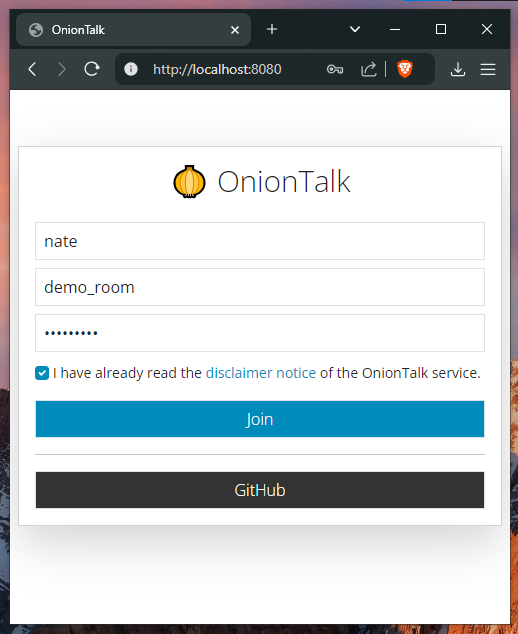
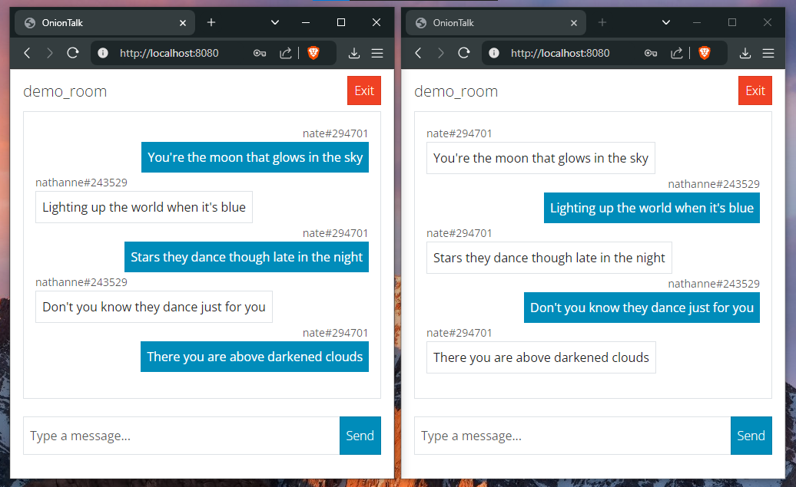

# 🧅 OnionTalk

OnionTalk is a secure, end-to-end encrypted chat application designed for deployment on the TOR Network as an onion service. It features room-based conversations with encrypted messaging, user presence tracking, and typing indicators.

## Features

- 🔒 End-to-end encryption using AES-GCM
- 🚪 Private chat rooms with password protection
- 👥 Real-time user presence tracking
- ⌨️ Live typing indicators
- 🛡️ Built for TOR Network deployment
- 🔐 Room-specific encryption keys derived from room name and password
- 🗑️ Automatic room cleanup when inactive
- 📱 Responsive design using Bootstrap

<p align="center">
    
    <br/>
    <i>OnionTalk homepage screenshot.</i>
</p>

<p align="center">
    
    <br/>
    <i>OnionTalk messaging page screenshot. (Lyrics from "Aphrodite" by The Ridleys)</i>
</p>

## Security Features

- Messages are encrypted client-side using AES-GCM encryption
- Room keys are derived using SHA-256 from room name and password
- All user inputs are sanitized to prevent XSS attacks
- Room names are validated to prevent injection attacks
- HTML content is escaped in messages
- WebSocket connections are authenticated

## License

```
Copyright (c) 2025 - Nathanne Isip
This file is part of OnionTalk.

OnionTalk is free software: you can redistribute it and/or modify
it under the terms of the GNU General Public License as published
by the Free Software Foundation, either version 3 of the License,
or (at your option) any later version.

OnionTalk is distributed in the hope that it will be useful, but
WITHOUT ANY WARRANTY; without even the implied warranty of
MERCHANTABILITY or FITNESS FOR A PARTICULAR PURPOSE. See the
GNU General Public License for more details.

You should have received a copy of the GNU General Public License
along with OnionTalk. If not, see <https://www.gnu.org/licenses/>.
```

## Disclaimer

Please refer to the legal [disclaimer](DISCLAIMER.md) provided with the application regarding usage terms and developer liability.
